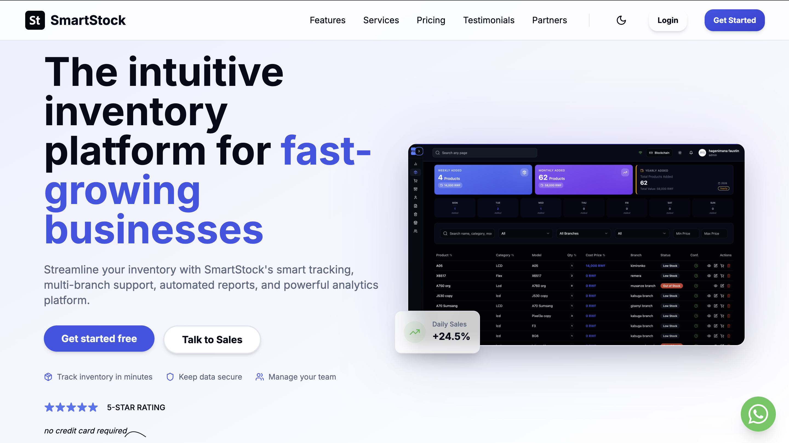
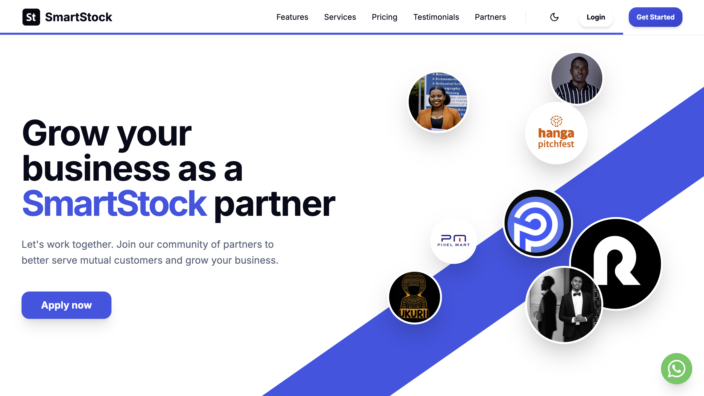
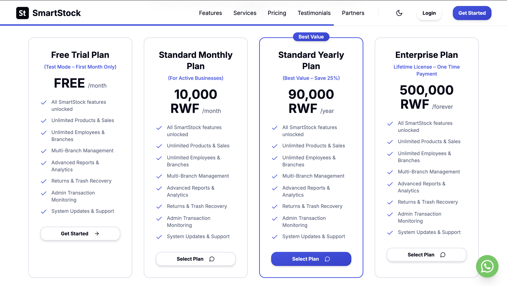

# SmartStock - Modern Inventory Management System



SmartStock is a powerful, modern, and intuitive inventory management solution designed for businesses in Rwanda and beyond. It helps businesses track inventory, manage stock levels, monitor sales, and generate automated reports with ease. Built with performance and user experience in mind, SmartStock supports multiple branches, role-based access control, and English & Kinyarwanda languages.


## 📸 System Overview


*Figure 1: SmartStock Dashboard - Real-time analytics and quick actions.*

## 🚀 Key Features

*   **Inventory & Store Management**: Track products, stock levels, and movements in real-time.
*   **Sales & Returns**: Seamlessly record sales and manage returns.
*   **Multi-Branch Support**: scalable for businesses with multiple locations.
*   **Advanced Analytics**: Insightful dashboards for sales, profits, and inventory performance.
*   **Role-Based Access**: Manage permissions for admins, managers, and staff.
*   **Bilingual Support**: Fully localized in English and Kinyarwanda.
*   **PWA Support**: Installable as a progressive web app for mobile and desktop.
*   **Offline Support**: Continue working even with unstable internet connections.

## 🛠 Tech Stack

SmartStock is built using a modern frontend technology stack:

*   **Framework**: [React](https://reactjs.org/) with [TypeScript](https://www.typescriptlang.org/)
*   **Build Tool**: [Vite](https://vitejs.dev/)
*   **Styling**: [Tailwind CSS](https://tailwindcss.com/) & [Shadcn UI](https://ui.shadcn.com/)
*   **State Management**: React Context API & [TanStack Query](https://tanstack.com/query)
*   **Backend/Auth**: [Firebase](https://firebase.google.com/)
*   **Routing**: [React Router](https://reactrouter.com/)
*   **Charts**: [Recharts](https://recharts.org/)
*   **Icons**: [Lucide React](https://lucide.dev/)

## 📂 Folder Structure

The project structure is organized as follows:

```
src/
├── components/         # Reusable UI components
│   ├── auth/          # Authentication related components
│   ├── layout/        # Layout components (Sidebar, Header, etc.)
│   └── ui/            # Basic UI primitives (Button, Input, etc.)
├── contexts/          # React Context providers (Auth, Theme, Language)
├── data/              # Static data and mock files (e.g., mockPlans.ts)
├── firebase/          # Firebase configuration and initialization
├── functions/         # Utility functions and helpers
├── hooks/             # Custom React hooks
├── lib/               # Shared libraries and utilities
├── pages/             # Application pages and route handlers
├── types/             # TypeScript type definitions
├── App.tsx            # Main application component
└── main.tsx           # Application entry point
```


## 🤝 Partners & Community


*Figure 3: Joined by industry leaders and partners.*

## 📖 Customization Guide


### Branding
To customize the branding (Name, Logo, Colors):
1.  **Name & Logo**: Updated in `src/components/layout/Header.tsx`, `Sidebar.tsx`, and `LandingPage.tsx`.
2.  **Theme Colors**: Controlled via Tailwind configuration in `tailwind.config.ts` and CSS variables in `src/index.css`.

### Pricing Plans
Pricing plans are defined in `src/data/mockPlans.ts`. Modify this file to update plan names, prices, durations, and features.


*Figure 2: Pricing Logic and Plan Display.*

### Navigation
Sidebar menu items are defined in `src/components/layout/Sidebar.tsx`.

## 👨‍💻 Author Info

**Theodev Rwanda**
*   **Role**: Lead Developer
*   **Contact**: [Join our WhatsApp Channel](https://whatsapp.com/channel/0029Vb79i5j8KMqkov7ng61H)
*   **Support**: [Chat on WhatsApp](https://wa.me/250792734752) (Personal: 0792734752)

---

## ☕ Support the Project

If you find this project helpful, consider supporting its development!

### Global Support
<a href="https://buymeacoffee.com/theodevrwanda" target="_blank">
    
</a>

### Local Support (Rwanda)
- **Bank of Kigali (BK)**: 100246486087
- **Recipient**: Theogene iradukunda
- **MoMo**: 0792734752